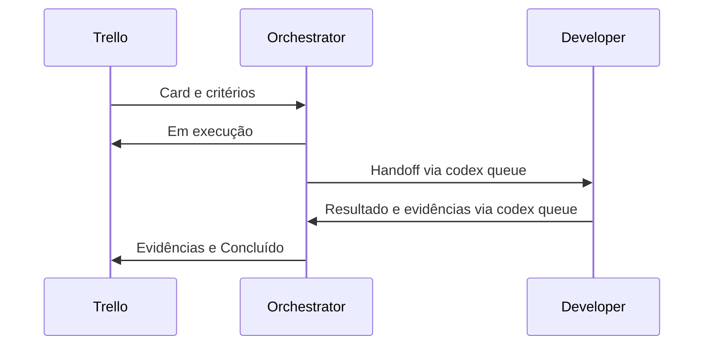

# Dev Orchestra

Dev Orchestra é um processo e um conjunto de contratos para organizar desenvolvimento assistido por IA. Ele separa a coordenação da execução e registra o trabalho em fontes distintas: backlog, memória durável, repositório e contexto temporário da sessão. Você combina ferramentas existentes e acompanha a execução em sessões independentes, cada uma aberta em seu próprio terminal. Este repositório fornece os contratos e guias; não há um runtime ou instalador próprio do Dev Orchestra.

## Dos post-its às sessões coordenadas

A ideia nasceu de uma rotina real: bugs, melhorias e features eram anotados em post-its no monitor. Conforme o volume cresceu, essas anotações viraram um Kanban no Trello, com um board por projeto. A organização melhorou, mas ainda era necessário copiar manualmente cada tarefa do Trello para o agente.

Daí veio a pergunta: por que não conectar o Trello ao agente? A experiência com a integração agradou e abriu espaço para o próximo passo: um Orchestrator que consulta o backlog, delega e recebe resultados de outras sessões. A escolha foi tornar esse trabalho observável em outros terminais, em vez de concentrar tudo em uma única sessão com subagentes.

Cada sessão é uma conversa independente com instruções e contexto próprios. Por isso o Orchestrator envia ao worker uma tarefa explícita e um endereço de retorno, em vez de presumir que as duas sessões compartilham o histórico. Terminais separados deixam esse trabalho visível para a pessoa desenvolvedora, que acompanha as trocas e continua responsável pelas decisões críticas de produto, arquitetura e risco.


*Configuração ilustrativa: papéis adicionais são opcionais. O primeiro fluxo usa somente Orchestrator e Developer.*

## Como funciona



O Orchestrator lê o card, registra o início e delega pelo canal entre sessões. Depois encerra o turno e aguarda o retorno, sem polling nem inspeção de arquivos ou processos para deduzir conclusão. O Developer executa e devolve evidências pelo mesmo canal. Só então o Orchestrator avalia os critérios e atualiza o backlog.

| Parte | Responsabilidade |
| --- | --- |
| Task Source | Backlog, prioridade, critérios e estado operacional; Trello é o exemplo inicial |
| [Orchestrator](roles/orchestrator.md) | Coordena, delega, avalia resultados e atualiza o backlog |
| [Developer](roles/developer.md) | Executa a tarefa delimitada e retorna evidências |
| [QA](roles/qa.md), opcional | Valida critérios e evidências quando necessário |
| [Planner](roles/planner.md), opcional | Investiga dependências e divide trabalho |
| AI Memory | Preserva decisões e conhecimento durável reutilizável |
| Git | Versiona código, documentação, contratos e evidências |
| Sessão | Mantém o contexto temporário da execução |

**Task Source** é o serviço de backlog; **worker** é uma sessão que executa uma tarefa delegada; e **MCP** é o protocolo usado para conectar ferramentas externas à CLI do agente. No exemplo, Trello é o Task Source e Developer é o worker. O [modelo de contexto](docs/CONTEXT-MODEL.md) explica onde cada tipo de informação fica.

Memória recuperada é dado histórico, não instrução vigente. A política do projeto orienta o que promover a conhecimento durável; os hooks do AI Memory também podem capturar eventos técnicos de sessões. São responsabilidades diferentes, descritas no [modelo de contexto](docs/CONTEXT-MODEL.md).

## Maturidade

O transporte Codex entre sessões e o sandbox local foram validados. O App Server é experimental na CLI consultada (`0.156.1`); não foi estabelecida uma versão mínima. O fluxo completo Trello + AI Memory e a retomada gerenciada ainda precisam de validação de ponta a ponta. O tutorial abaixo é o roteiro para essa validação, não uma afirmação de que ela já ocorreu. O [registro do POC](docs/CODEX-QUEUE-POC.md) separa evidências e pendências.

## Quick Start: um card, dois agentes

O caminho principal usa **Linux/Ubuntu + Codex + AI Memory + Trello**. Você precisa de Git, curl, Docker acessível pelo seu usuário, autenticação no Codex, conta Trello e navegador para OAuth. Reserve três terminais: um mantém o App Server aberto; os outros dois hospedam as sessões Orchestrator e Developer. Os comandos de preparação podem ser executados antes nesses mesmos terminais. Em cada etapa, os comandos marcados como shell são executados no terminal; `/rename` e `/status` são digitados dentro da sessão Codex.

O percurso é: preparar as ferramentas ([SETUP](docs/SETUP.md)), criar o card, abrir o App Server e as duas sessões, e então pedir ao Orchestrator que execute o card. A tabela em [Observar e conferir a conclusão](#8-observar-e-conferir-a-conclusão) mostra as evidências que confirmam cada fase. Não é necessário executar o POC isolado para seguir este caminho.

### 1. Instalar e preparar o checkout

Em uma instalação Ubuntu nova, comece com:

```bash
sudo apt update
sudo apt install -y git curl ca-certificates
curl -fsSL https://chatgpt.com/codex/install.sh | sh
export PATH="$HOME/.local/bin:$PATH"
codex login
codex login status
```

O instalador é o da [documentação oficial do Codex](https://learn.chatgpt.com/docs/codex/cli). Instale e verifique Docker seguindo [SETUP: Docker](docs/SETUP.md#docker). O guia traz os comandos completos para uma instalação nova e as verificações de acesso.

Clone um checkout de demonstração e use **este mesmo diretório em todos os terminais**:

```bash
git clone https://github.com/ronaldomafra/dev-orchestra.git "$HOME/dev-orchestra-demo"
cd "$HOME/dev-orchestra-demo"
git status --short
git --version
curl --version
docker info
codex --version
codex queue --help
```

Se o diretório já existir, confira seu conteúdo e use o checkout escolhido, sem sobrescrevê-lo. Neste tutorial há apenas um worker editando; a adoção com vários workers exige coordenar branches/worktrees.

### 2. Configurar AI Memory e Trello

**Antes de iniciar o App Server**, execute [SETUP: AI Memory](docs/SETUP.md#ai-memory): baixar o wrapper para `~/.local/bin` com verificação de checksum, iniciar o servidor Docker em `127.0.0.1:49374` com volume persistente e instalar hooks/MCP. O modo sem chaves LLM opcionais é suficiente. Após instalar o wrapper e o servidor, os comandos essenciais são:

```bash
ai-memory install-mcp --client codex --apply
ai-memory install-hooks --agent codex --apply
codex mcp add trello --url https://mcp.trello.com/v1
```

Conclua o OAuth no navegador, escolhendo o workspace Trello que contém o board. Se a autenticação não tiver sido concluída ao adicionar:

```bash
codex mcp login trello
```

Confira os registros:

```bash
codex mcp list
ai-memory run --help
```

A configuração listada não prova acesso ao board: a leitura pela sessão do Orchestrator será a verificação real. Detalhes e diagnóstico estão em [SETUP: Trello](docs/SETUP.md#trello). Se já há um App Server, confirme que ele usa essa configuração; não inicie outro na mesma porta. Se estiver desatualizado, combine seu encerramento e reabertura com quem usa as sessões antes de continuar.

### 3. Criar a tarefa no Trello

No navegador, crie um board de demonstração no workspace autorizado com as listas **Backlog**, **Em execução** e **Concluído**. Em Backlog, crie o card **DEMO-001: Meu primeiro fluxo**. Copie as URLs reais do board e do card para informar ao Orchestrator.

Use esta descrição no card:

```text
Objetivo: criar docs/demo/primeiro-fluxo.md para demonstrar o fluxo.

Critérios de aceite:
1. Criar somente docs/demo/primeiro-fluxo.md como artefato da tarefa.
2. O arquivo deve conter exatamente o conteúdo esperado abaixo, em UTF-8,
   com uma quebra de linha ao final.
3. Preservar quaisquer mudanças preexistentes. Se o arquivo já existir,
   reportar o conflito antes de sobrescrevê-lo.
4. Ler o conteúdo criado e executar git status --short --untracked-files=all;
   devolver essas evidências com STATUS, TASK, SUMMARY e EVIDENCE.
5. Não fazer commit nem push. Retornar pelo codex queue ao Orchestrator.

Conteúdo esperado:
# Meu primeiro fluxo

- Task Source: mantém o backlog e o estado operacional das tarefas.
- Orchestrator: coordena o trabalho e atualiza o backlog com evidências.
- Developer: executa a tarefa recebida e devolve o resultado ao Orchestrator.
```

O arquivo será criado pelo Developer **quando você executar o tutorial**; ele não acompanha esta reestruturação documental. Nenhuma linguagem de programação é necessária.

### 4. Terminal do App Server

Na raiz do checkout, verifique se o serviço já está ativo:

```bash
cd "$HOME/dev-orchestra-demo"
curl -i http://127.0.0.1:4500/readyz
curl -i http://127.0.0.1:4500/healthz
```

Se ambos responderem HTTP 200 e for o App Server esperado, reutilize-o. Se não houver serviço ativo, inicie neste terminal:

```bash
codex app-server --listen ws://127.0.0.1:4500
```

Mantenha-o aberto. Antes de abrir a sessão Orchestrator, use seu terminal para repetir os dois `curl` e obter HTTP 200. Se houver serviço respondendo com erro, consulte o [diagnóstico](docs/SETUP.md#diagnostico); não inicie uma segunda instância para contornar o problema.

### 5. Terminal do Orchestrator

Primeira criação:

```bash
cd "$HOME/dev-orchestra-demo"
ai-memory run --new orchestrator codex --remote ws://127.0.0.1:4500 --model gpt-6-sol -c 'model_reasoning_effort="medium"'
```

Sol com raciocínio médio é uma recomendação inicial para coordenar o primeiro fluxo. Os modelos disponíveis dependem da conta e da versão da CLI; confira a escolha efetiva em `/status`. Se o modelo não estiver disponível, peça ao Orchestrator uma alternativa antes de continuar.

Dentro do Codex, digite `/rename orchestrator`. Depois envie:

```text
Leia AGENTS.md, roles/orchestrator.md e docs/PROTOCOL.md.
Assuma o papel de Orchestrator. Aguarde eu informar board, card e destino
Developer para iniciar. O canal é codex queue no endpoint
ws://127.0.0.1:4500. Após delegar, encerre o turno e aguarde o resultado.
```

Digite `/status` e anote o **Session UUID do Orchestrator**. Esse é o destino `RETURN_TO` dos resultados, não o UUID do Developer. Confira também o modelo e o esforço de raciocínio efetivos.

Com o Orchestrator aberto, peça que ele escolha a configuração da sessão de execução e gere o comando e o prompt completos. Por exemplo:

```text
Preciso de uma sessão Developer para executar DEMO-001: criar o arquivo
Markdown docs/demo/primeiro-fluxo.md com o conteúdo e critérios do card.
Escolha um modelo e nível de raciocínio adequados à complexidade e ao
consumo, justifique brevemente e forneça: comando de criação com AI Memory,
nome sugerido, prompt completo da sessão e comando de retomada. Eu abrirei
a sessão no outro terminal. Use o mesmo App Server e indique como destino
de retorno o Session UUID do Orchestrator confirmado em /status.
```

Para esta tarefa curta e delimitada, uma resposta inicial adequada é Luna com raciocínio médio. Ela deve fornecer um comando equivalente ao abaixo e um prompt que substitua `<UUID confirmado do Orchestrator>` pelo valor real obtido em `/status`:

```bash
cd "$HOME/dev-orchestra-demo"
ai-memory run --new developer codex --remote ws://127.0.0.1:4500 --model gpt-6-luna -c 'model_reasoning_effort="medium"'
```

Na resposta do Orchestrator, o comando de retomada correspondente deve trocar `--new developer` por `--workstream developer`, mantendo o restante, inclusive modelo e esforço:

```bash
ai-memory run --workstream developer codex --remote ws://127.0.0.1:4500 --model gpt-6-luna -c 'model_reasoning_effort="medium"'
```

Dentro da nova sessão, use `/rename developer` e envie:

```text
Leia AGENTS.md, roles/developer.md e docs/PROTOCOL.md. Assuma o papel
Developer. Execute DEMO-001: crie somente docs/demo/primeiro-fluxo.md,
com UTF-8 e uma quebra de linha final. O conteúdo deve ser exatamente:
# Meu primeiro fluxo

- Task Source: mantém o backlog e o estado operacional das tarefas.
- Orchestrator: coordena o trabalho e atualiza o backlog com evidências.
- Developer: executa a tarefa recebida e devolve o resultado ao Orchestrator.
Crie somente esse artefato; preserve mudanças existentes e reporte conflito
antes de sobrescrever se o arquivo já existir. Leia o arquivo e execute
git status --short --untracked-files=all. Não faça commit nem push e não
altere o Trello. Envie autonomamente um resultado com STATUS, TASK, SUMMARY
e EVIDENCE via codex queue, usando o endpoint ws://127.0.0.1:4500 e
RETURN_TO <UUID confirmado do Orchestrator>.
```

`/status` na sessão nova confirma modelo e esforço efetivos. Se Luna não estiver disponível, peça uma alternativa ao Orchestrator; não invente uma flag de seleção.

### 6. Abrir e confirmar o Developer

No terminal próprio, execute o comando de criação que o Orchestrator forneceu (o exemplo para DEMO-001 está na etapa anterior). Na sessão Codex recém-aberta, use `/rename developer` e envie o prompt completo recebido. Em `/status`, confira o modelo/esforço efetivos e anote o **Session UUID do Developer**. Use o nome exato `developer` se for único e resolvível; o UUID confirmado é o fallback. Não escolha entre sessões ambíguas por tentativa. Não é necessário abrir uma sessão extra para testar o transporte.

### 7. Pedir a execução ao Orchestrator

Volte ao terminal do Orchestrator. Substitua os campos entre `<...>` antes de enviar:

```text
Execute DEMO-001: Meu primeiro fluxo.
Board: <URL real do board>
Card: <URL real do card>
Developer: developer
UUID confirmado do Developer: <Session UUID obtido no /status do Developer>
RETURN_TO: <Session UUID obtido no /status do Orchestrator>
Canal: codex queue --remote ws://127.0.0.1:4500

1. Consulte o board e o card pelo MCP Trello, confirme título, lista e
   critérios. Se o acesso falhar, informe o bloqueio; não invente o conteúdo
   nem afirme que atualizou o card.
2. Mova o card de Backlog para Em execução e confira o retorno real da operação.
3. Delegue ao Developer via codex queue --thread com nome único ou UUID
   confirmado e --message com TASK: DEMO-001, INSTRUCTION contendo todos
   os critérios e conteúdo esperado, referência ao card e RETURN_TO acima.
   Inclua o endpoint e a obrigação de enviar o resultado pelo mesmo canal.
   Não implemente o arquivo você mesmo. Não faça commit nem push.
4. Após o enfileiramento, encerre o turno e aguarde a resposta pelo canal.
   Não faça polling nem inspecione arquivos ou processos para inferir conclusão.
5. Ao receber o resultado, avalie cada critério e as evidências de leitura
   do arquivo e git status. Se faltar algo, devolva ao Developer pelo canal.
6. Com os critérios atendidos, acrescente à descrição do card um resumo
   de resultado e evidências, preservando o objetivo e todos os critérios.
   Mova para Concluído e confirme o estado por uma leitura real do card.
   Só afirme atualização após retorno real do Trello. Se falhar, reporte
   implementação pronta e sincronização pendente, sem declarar o fluxo concluído.
```

O canal aceita mensagens como descrito no [protocolo](docs/PROTOCOL.md#transporte-codex). O agente executa o comando de fila; você não precisa copiar o handoff e o resultado entre terminais. A [documentação do Trello MCP](https://support.atlassian.com/trello/docs/connect-trello-to-ai-assistants-with-trello-mcp/) lista comentários e anexos como funcionalidades futuras; por isso este fluxo usa a descrição do card para evidências.

### 8. Observar e conferir a conclusão

| Fase | Resultado esperado |
| --- | --- |
| Preparação | MCPs registrados; Orchestrator consegue ler o card real |
| Início | Card em Em execução, confirmado pelo Trello |
| Delegação | Fila aceita o handoff e a sessão Developer recebe DEMO-001 |
| Execução | Developer cria o arquivo, lê o conteúdo e coleta git status |
| Retorno | Orchestrator recebe STATUS, TASK, SUMMARY e EVIDENCE pelo canal |
| Conclusão | Critérios avaliados, descrição com evidências e card em Concluído |

Após o retorno, você também pode conferir no shell do checkout:

```bash
cat docs/demo/primeiro-fluxo.md
git status --short --untracked-files=all
```

Em um checkout limpo, o status deve incluir `?? docs/demo/primeiro-fluxo.md`. Mudanças técnicas de configuração eventualmente geradas pelas ferramentas devem ser identificadas separadamente na evidência. `git diff` sozinho não mostra o conteúdo de um arquivo novo ainda não rastreado. O tutorial não faz commit automático.

- [ ] O arquivo contém exatamente o texto do card.
- [ ] O Developer enviou o resultado e o Orchestrator o recebeu.
- [ ] O Orchestrator avaliou todos os critérios.
- [ ] O Trello confirmou a descrição preservada com evidências e a lista Concluído.
- [ ] Nenhum commit ou push foi realizado pelo tutorial.

<a id="criar-e-retomar-sessoes"></a>

## Criar e retomar sessões

Use `--new` apenas na primeira criação. Depois que a instância anterior daquele workstream encerrar, retome no mesmo checkout, com uma instância ativa por workstream.

As configurações abaixo são recomendações iniciais para o fluxo do tutorial; modelo é escolhido conforme a tarefa, não é fixo do papel. Confira modelo e esforço efetivos em `/status`; se não estiverem disponíveis, peça uma alternativa ao Orchestrator.

Terminal Orchestrator:

```bash
cd "$HOME/dev-orchestra-demo"
ai-memory run --workstream orchestrator codex --remote ws://127.0.0.1:4500 --model gpt-6-sol -c 'model_reasoning_effort="medium"'
```

Terminal Developer:

```bash
cd "$HOME/dev-orchestra-demo"
ai-memory run --workstream developer codex --remote ws://127.0.0.1:4500 --model gpt-6-luna -c 'model_reasoning_effort="medium"'
```

O App Server deve estar disponível no mesmo endpoint. As opções AI Memory ficam antes de `codex`; `--remote` fica depois. No caminho gerenciado, não acrescente `resume <UUID>`: o AI Memory seleciona a sessão vinculada. `/rename` altera o título Codex, não a chave do workstream. Se a chave é `developer`, usar `--workstream desenvolvedor` resulta em `managed workstream not found`, mesmo que esse seja o título da sessão.

Para verificar os vínculos, no shell:

```bash
ai-memory workstreams --json
```

`linked_harnesses` contendo `codex` comprova um vínculo, não a retomada completa ou memória durável. Teste **continuidade da sessão** registrando um marcador único na conversa e seu UUID por `/status`, encerrando a instância, retomando com `--workstream` e conferindo o mesmo UUID e a recuperação do marcador.

Teste **conhecimento durável** separadamente: registre uma decisão útil pelo MCP AI Memory com fonte e escopo do projeto; em uma sessão independente, peça uma busca explícita pelo MCP e confira a decisão, sua origem e relevância. Não use o marcador transitório como conhecimento durável. O [guia de instalação](docs/SETUP.md#verificar-memoria-e-continuidade) detalha as evidências; a [fonte oficial de workstreams](https://github.com/akitaonrails/ai-memory/blob/main/docs/managed-workstreams.md) explica a seleção gerenciada.

Tokens usados como contexto não equivalem automaticamente a custo ou cota: esses limites dependem do plano e das regras de uso do Codex. Envie no handoff somente a tarefa, critérios, referências e evidências necessárias e peça um retorno curto. Aumente modelo ou esforço quando houver dificuldade ou risco real. Estas são recomendações iniciais, não benchmarks nem garantias. Consulte [preços e limites do Codex](https://learn.chatgpt.com/docs/pricing) para sua conta.

## Expandir e adotar em um projeto existente

Depois do primeiro fluxo, adicione QA ou Planner quando houver necessidade. Crie workstreams separados `qa` e `planner`, um terminal por sessão, e carregue respectivamente [roles/qa.md](roles/qa.md) ou [roles/planner.md](roles/planner.md). O [workflow](docs/WORKFLOW.md#papeis-opcionais) traz os comandos e o retorno esperado. **Tester** é um exemplo de especialização: `roles/tester.md` não existe. Para usá-lo, escreva seu próprio contrato com missão, entrada, escopo, evidências e retorno antes de iniciar a sessão.

Trello é um exemplo de Task Source. Você pode conectar outro serviço via MCP existente ou criar um conector MCP próprio, definindo operações e estados conforme [TASK-SOURCE](docs/TASK-SOURCE.md). Isso não significa que este repositório já implemente adapters para outros serviços.

Em um projeto existente, leia seu `AGENTS.md` e concilie estas regras com as convenções locais, sem sobrescrevê-lo. Incorpore os papéis, protocolo e templates necessários, adapte o board e os critérios ao projeto, e verifique `git status` antes de editar. Para execução paralela, combine branches/worktrees e a integração dos resultados. Use o [workflow de adoção](docs/WORKFLOW.md#adotar-em-outro-repositorio).

## Mapa de documentos

| Documento | Quando consultar |
| --- | --- |
| [SETUP](docs/SETUP.md) | Instalação Ubuntu, configuração, verificações e diagnóstico |
| [AGENTS.md](AGENTS.md) | Contrato global vigente |
| [Papéis](roles/) | Responsabilidade de cada sessão |
| [WORKFLOW](docs/WORKFLOW.md) | Ciclo operacional e expansão |
| [TASK-SOURCE](docs/TASK-SOURCE.md) | Backlog, Trello e outros conectores |
| [PROTOCOL](docs/PROTOCOL.md) | Handoffs, resultados e destinos |
| [Templates](templates/) | [Handoff](templates/handoff.md) e [resultado](templates/result.md) |
| [ARCHITECTURE](docs/ARCHITECTURE.md) | Componentes e limites |
| [CONTEXT-MODEL](docs/CONTEXT-MODEL.md) | Onde cada informação vive |
| [CODEX-QUEUE-POC](docs/CODEX-QUEUE-POC.md) | Diagnóstico do transporte e histórico local |
| [Validação DOCS-001](docs/DOCS-001-VALIDATION.md) | Verificações desta revisão e limites |

## Agradecimentos

Um agradecimento especial ao [Akita](https://github.com/akitaonrails) pelo [AI Memory](https://github.com/akitaonrails/ai-memory), uma peça importante da proposta do Dev Orchestra. Seu trabalho oferece a base para preservar conhecimento durável e apoiar a continuidade entre sessões, aspectos fundamentais para a colaboração que queremos construir.
