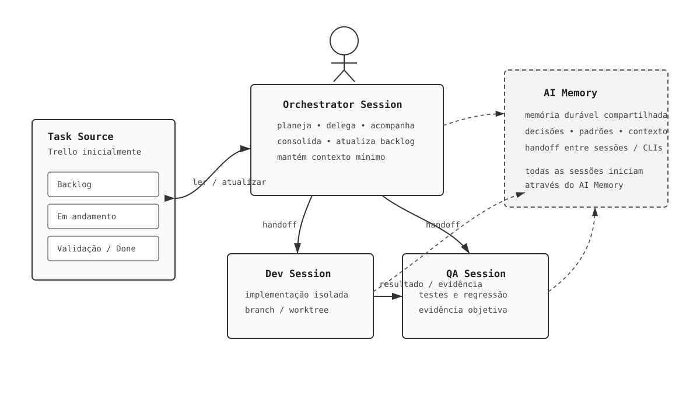

# Dev Orchestra

**Dev Orchestra** é uma forma simples de organizar desenvolvimento assistido por IA usando sessões com papéis claros, um backlog visual e memória compartilhada.

Não é um framework de agentes. Não é um novo serviço. Não tenta automatizar tudo.

A ideia é apenas organizar melhor o trabalho que já fazemos com Codex, Claude Code e outras CLIs.



## Por que isso existe?

A ideia nasceu de um problema bem comum em projetos pessoais: conforme bugs, melhorias, ideias e decisões aumentavam, ficou difícil manter tudo organizado apenas dentro das conversas com agentes de IA.

A primeira tentativa de organização foi simples: **post-its no monitor**.

Funcionava para lembrar o que precisava ser feito, mas não era uma boa fonte de contexto para as sessões de IA.

Ao começar a usar o Trello como backlog, surgiu uma pergunta:

> Se eu já organizo visualmente as tarefas no Trello, por que o agente que coordena o desenvolvimento não pode conversar diretamente com esse backlog?

Daí nasceu o Dev Orchestra.

A proposta é manter uma solução de baixo custo e fácil de entender:

- Trello como quadro visual de trabalho;
- uma sessão de IA coordenando o fluxo;
- sessões separadas para implementação e testes;
- AI Memory preservando contexto entre sessões e até entre CLIs diferentes;
- Git mantendo código e documentação versionados.

A simplicidade é parte da arquitetura. Se algo não ajuda diretamente a **organizar tarefas, preservar contexto ou separar responsabilidades**, provavelmente não precisa fazer parte do Dev Orchestra.

## A ideia em 30 segundos

```text
Trello / Task Source
        |
        v
  Orchestrator
    /       \
   v         v
Developer    QA
    \       /
     resultados

AI Memory -> contexto compartilhado entre as sessões
Git       -> código e documentação
```

### Orchestrator

É a sessão que coordena o trabalho.

Ela:

- consulta o backlog;
- escolhe o próximo card;
- move o card para a etapa correta;
- delega implementação para o Developer;
- envia a implementação para validação do QA;
- recebe os resultados;
- atualiza o Trello;
- registra conhecimento durável quando necessário.

No fluxo inicial, **o Orchestrator é o dono das alterações de estado no Trello**.

### Developer

Recebe uma tarefa delimitada, implementa e devolve:

- resumo do que foi feito;
- arquivos alterados;
- testes executados;
- riscos ou observações relevantes.

O Developer não precisa administrar o backlog.

### QA

Recebe os critérios de aceite e a implementação produzida pelo Developer.

Valida o resultado e devolve evidências ao Orchestrator.

O QA também não precisa mover cards no Trello.

## Fluxo básico

Um fluxo simples pode usar estas colunas:

```text
Backlog -> Em execução -> Em teste -> Concluído
```

Os nomes das colunas não são importantes. O importante é o Orchestrator manter o quadro sincronizado com o estado real do trabalho.

Exemplo:

1. Orchestrator lê o backlog.
2. Escolhe um card e move para **Em execução**.
3. Envia a tarefa para o Developer.
4. Developer implementa e devolve o resultado.
5. Orchestrator move o card para **Em teste**.
6. QA valida a implementação.
7. Se aprovado, Orchestrator move para **Concluído**.
8. Se houver falha, Orchestrator devolve para **Em execução** com a evidência do QA.

## Requisitos

Para o fluxo inicial você precisa apenas de:

- Git;
- **AI Memory**;
- pelo menos uma CLI de desenvolvimento com IA:
  - Codex CLI; ou
  - Claude Code;
- Trello + Trello MCP, caso o Trello seja o seu `Task Source`.

> **Importante:** todas as sessões do Dev Orchestra devem ser iniciadas através do AI Memory. Sem isso, a sessão pode funcionar normalmente, mas perde a camada de memória compartilhada esperada pelo fluxo.

## Instalação

### 1. Codex CLI

```bash
npm install -g @openai/codex@latest
```

Verifique:

```bash
codex --version
```

Documentação: https://developers.openai.com/

### 2. Claude Code

```bash
npm install -g @anthropic-ai/claude-code
```

Verifique:

```bash
claude --version
```

Documentação: https://docs.anthropic.com/en/docs/claude-code/

Você pode usar somente Codex, somente Claude Code ou misturar os dois.

### 3. AI Memory

Instale o AI Memory seguindo a documentação oficial:

https://github.com/akitaonrails/ai-memory

Verifique:

```bash
ai-memory --help
```

O AI Memory suporta Codex e Claude Code e pode instalar automaticamente a integração necessária quando a CLI é iniciada através de `ai-memory run`.

### 4. Trello MCP

O Trello MCP é o conector entre o Orchestrator e o Trello.

Servidor oficial:

```text
https://mcp.trello.com/v1
```

#### Codex

```bash
codex mcp add trello --url https://mcp.trello.com/v1
```

Verifique:

```bash
codex mcp list
```

#### Claude Code

```bash
claude mcp add --transport http trello https://mcp.trello.com/v1
```

Na primeira conexão, conclua a autorização do Trello no navegador e selecione o workspace que poderá ser acessado.

No modelo inicial do Dev Orchestra, **somente o Orchestrator precisa obrigatoriamente de acesso ao Trello MCP**. Developer e QA recebem as informações necessárias pelo handoff e podem permanecer focados em suas funções.

## Primeira execução

Abra três terminais no mesmo projeto.

Como o AI Memory mantém uma sessão ativa por workstream, use três nomes simples para permitir as sessões paralelas.

### Terminal 1 — Orchestrator

Na primeira vez:

```bash
ai-memory run --new orchestrator codex
```

Depois:

```bash
ai-memory run --workstream orchestrator codex
```

Primeira instrução da sessão:

```text
Leia AGENTS.md e roles/orchestrator.md e assuma o papel de Orchestrator.
```

### Terminal 2 — Developer

Na primeira vez:

```bash
ai-memory run --new developer codex
```

Depois:

```bash
ai-memory run --workstream developer codex
```

Primeira instrução:

```text
Leia AGENTS.md e roles/developer.md e assuma o papel de Developer.
```

### Terminal 3 — QA

Na primeira vez:

```bash
ai-memory run --new qa codex
```

Depois:

```bash
ai-memory run --workstream qa codex
```

Primeira instrução:

```text
Leia AGENTS.md e roles/qa.md e assuma o papel de QA.
```

Se preferir Claude Code, basta trocar `codex` por `claude`:

```bash
ai-memory run --new orchestrator claude
```

O papel pertence ao Dev Orchestra, não à CLI utilizada.

## AGENTS.md

`AGENTS.md` é a fonte única das regras globais do projeto.

Os papéis específicos ficam em:

```text
roles/orchestrator.md
roles/developer.md
roles/qa.md
roles/planner.md
```

Isso permite trocar Codex por Claude Code sem duplicar as regras do projeto.

## Onde cada informação vive

| Informação | Local |
| --- | --- |
| Backlog e estado da tarefa | Task Source / Trello |
| Decisões e conhecimento durável | AI Memory |
| Código e documentação | Git |
| Trabalho temporário da tarefa | Sessão atual |

Regra simples:

> **Trello mostra o que está acontecendo. AI Memory preserva o que aprendemos. Git registra o que construímos.**

## Estrutura do repositório

```text
.
├── AGENTS.md
├── README.md
├── docs/
│   ├── ARCHITECTURE.md
│   ├── CONTEXT-MODEL.md
│   ├── PROTOCOL.md
│   ├── TASK-SOURCE.md
│   ├── WORKFLOW.md
│   └── assets/
│       └── dev-orchestra-architecture.svg
├── roles/
│   ├── orchestrator.md
│   ├── developer.md
│   ├── qa.md
│   └── planner.md
└── templates/
    ├── handoff.md
    └── result.md
```

## Princípio de simplicidade

O Dev Orchestra começa manualmente de propósito.

Não precisamos inicialmente de:

- servidor próprio de orquestração;
- fila de mensagens;
- banco de dados adicional;
- dashboard próprio;
- runtime multiagente customizado;
- automação de tudo.

Primeiro usamos três terminais, Trello, AI Memory e Git.

Automação só deve ser adicionada quando um problema real aparecer repetidamente.

## Documentação

- [`AGENTS.md`](AGENTS.md) — regras globais.
- [`docs/WORKFLOW.md`](docs/WORKFLOW.md) — fluxo operacional.
- [`docs/ARCHITECTURE.md`](docs/ARCHITECTURE.md) — visão arquitetural.
- [`docs/CONTEXT-MODEL.md`](docs/CONTEXT-MODEL.md) — separação de contexto.
- [`docs/TASK-SOURCE.md`](docs/TASK-SOURCE.md) — abstração do backlog.
- [`docs/PROTOCOL.md`](docs/PROTOCOL.md) — handoff entre papéis.

## Estado atual

O Dev Orchestra está começando pelo fluxo manual:

```text
Trello -> Orchestrator -> Developer -> QA -> Orchestrator -> Trello
```

O objetivo agora é usar esse modelo em projetos reais, observar o que funciona e manter somente o que realmente melhora organização e produtividade.
